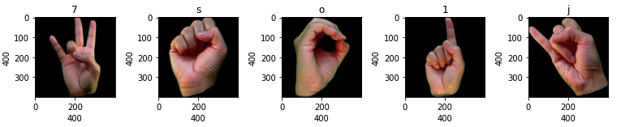

# american-hand-sign-classification

## american hand sign language - classification dataset


## Target classes (36)
````
'9','u','r','i','t','8','0','6','z','1','g','7','n',
's','a','v','h','c','j','d','m','f','o','3','q','k',
'y','4','e','l','b','x','2','p','w','5'
````

## Model
After loading data from google drive in colab and preprocessing the image data into the right shape - different models have been implemented and evaluated. 
Please have a look at the [notebook](asl-classification.ipynb).
